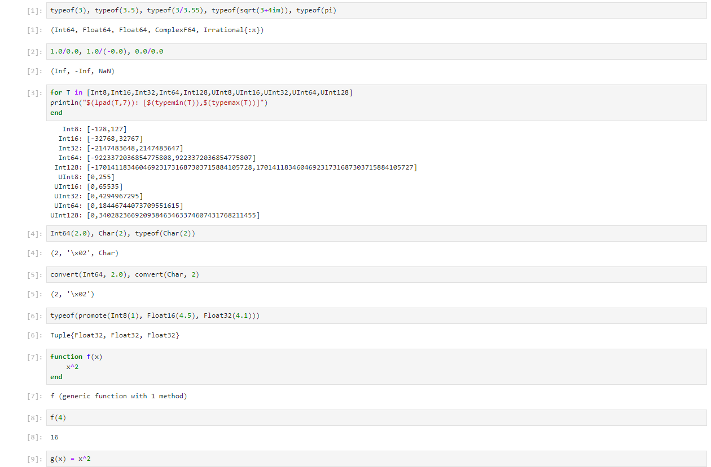
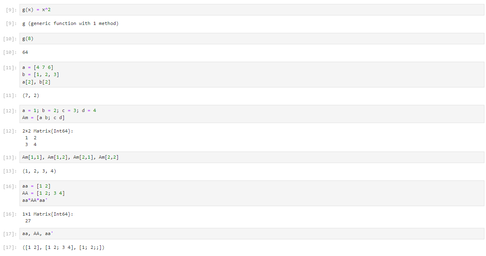
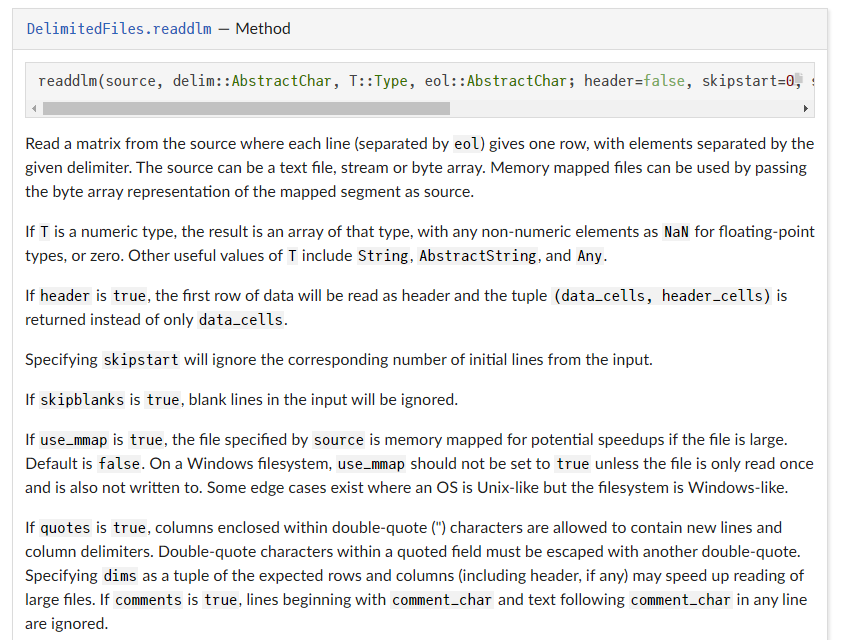
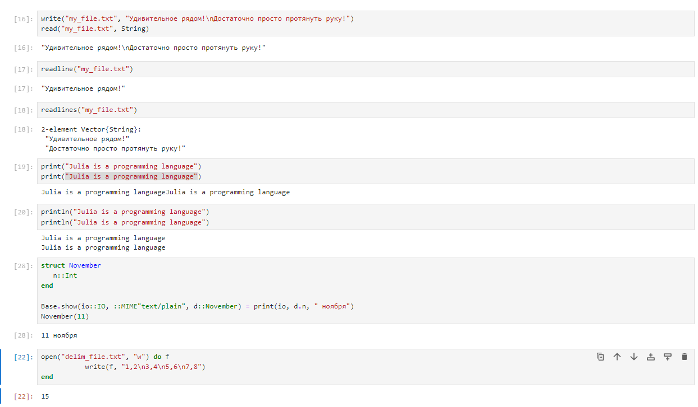
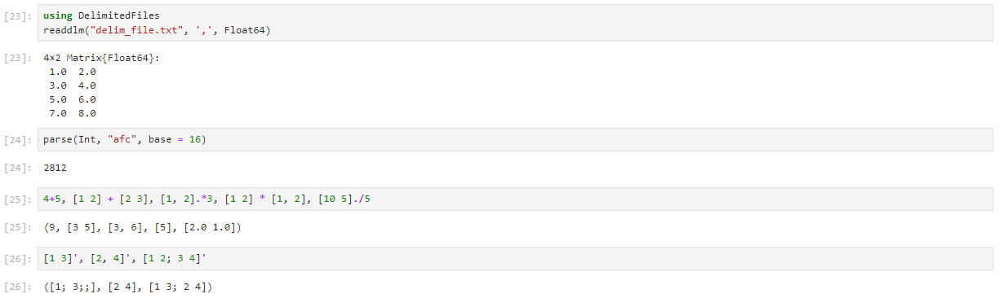

---
## Front matter
lang: ru-RU
title: "Лабораторная работа №1. Julia. Установка и настройка. Основные принципы"
subtitle: "Дисциплина: Компьютерный практикум по статистическому анализу данных"
author:
  - Манаева Варвара Евгеньевна.
institute:
  - Российский университет дружбы народов, Москва, Россия
date: 11 ноября 2023

## i18n babel
babel-lang: russian
babel-otherlangs: english

## Formatting pdf
toc: false
toc-title: Содержание
slide_level: 2
aspectratio: 169
section-titles: true
theme: metropolis
header-includes:
 - \metroset{progressbar=frametitle,sectionpage=progressbar,numbering=fraction}
 - '\makeatletter'
 - '\beamer@ignorenonframefalse'
 - '\makeatother'
---

# Цели и задачи работы

## Цель лабораторной работы

Подготовить рабочее пространство и инструментарий для работы с языком программирования Julia, на простейших примерах
познакомиться с основами синтаксиса Julia.

## Задачи

1. Установите под свою операционную систему Julia, Jupyter (разделы 1.3.1 и 1.3.2).
2. Используя Jupyter Lab, повторите примеры из раздела 1.3.3.
3. Выполните задания для самостоятельной работы (раздел 1.3.4).

# Выполнение

## Повторение задания (1)

{#fig:001 width=80%}

## Повторение задания (2)

{#fig:002 width=80%}

## Документация Julia, readdlm()

{#fig:006 width=80%}

## Прикладные применения (1)

{#fig:0012 width=80%}

## Прикладные применения (2)

{#fig:0013 width=80%}

# Выводы по проделанной работе

## Вывод

В результате выполнения работы мы на простейших примерах ознакомились с синтаксисом языка программирования Julia.

Были записаны скринкасты выполнения и защиты лабораторной работы.
