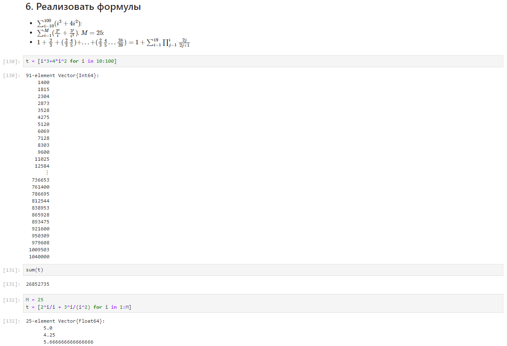

---
## Front matter
lang: ru-RU
title: "Лабораторная работа №2"
subtitle: "Дисциплина: Компьютерный практикум по статистическому анализу данных"
author:
  - Манаева Варвара Евгеньевна.
institute:
  - Российский университет дружбы народов, Москва, Россия
date: 18 ноября 2023

## i18n babel
babel-lang: russian
babel-otherlangs: english

## Formatting pdf
toc: false
toc-title: Содержание
slide_level: 2
aspectratio: 169
section-titles: true
theme: metropolis
header-includes:
 - \metroset{progressbar=frametitle,sectionpage=progressbar,numbering=fraction}
 - '\makeatletter'
 - '\beamer@ignorenonframefalse'
 - '\makeatother'
---

# Цели и задачи работы
## Цель

Изучить несколько структур данных, реализованных в Julia, научиться применять их и операции над ними для решения задач.

## Задачи

1. Используя Jupyter Lab, повторите примеры из раздела 2.2.
2. Выполните задания для самостоятельной работы (раздел 2.4).

# Выполнение лабораторной работы

# Повторение примеров

1. Реализация кортежей
2. Реализация словарей
3. Реализация множеств
4. Реализация массивов

{#fig:101 width=80%}

# Самостоятельная работа

## 1. Пересечение и объединение множеств $A = \{ 0, 3, 4, 9 \} $, $B = \{ 1, 3, 4, 7 \}$ и $C = \{ 0, 1, 2, 4, 7, 8, 9 \}$

{#fig:201 width=80%}

## 2. Примеры с выполнением операций над множествами элементов разных типов (1)

{#fig:2021 width=80%}

## 2. Примеры с выполнением операций над множествами элементов разных типов (2)

{#fig:2022 width=80%}

## 3. Создать разными способами несколько видов массивов

{#fig:2031 width=80%}

## 4. Создать массив квадратов натуральных чисел от 1 до 100

{#fig:204 width=80%}

## 5. С помощью пакета `Primes` сгенерировать массив первых 168 простых чисел, определим 89-е простое число, создадим срез массива с 89-го по 99-й элементов

{#fig:205 width=80%}

## 6. Реализовать формулы (1)

{#fig:2061 width=80%}

## 6. Реализовать формулы (2)

{#fig:2062 width=80%}

# Выводы по проделанной работе

## Вывод

В результате выполнения работы мы изучили несколько структур данных, реализованных в Julia, и научились применять их и
операции над ними для решения задач.

Были записаны скринкасты выполнения и защиты лабораторной работы.
