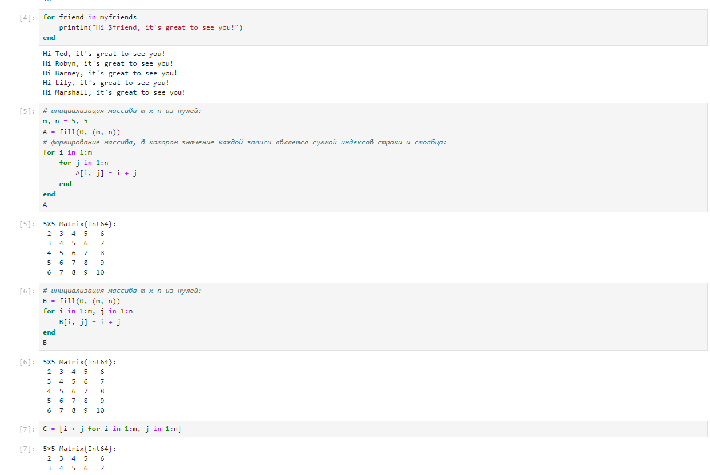

---
## Front matter
lang: ru-RU
title: "Лабораторная работа №3"
subtitle: "Дисциплина: Компьютерный практикум по статистическому анализу данных"
author:
  - Манаева Варвара Евгеньевна.
institute:
  - Российский университет дружбы народов, Москва, Россия
date: 17 ноября 2023

## i18n babel
babel-lang: russian
babel-otherlangs: english

## Formatting pdf
toc: false
toc-title: Содержание
slide_level: 2
aspectratio: 169
section-titles: true
theme: metropolis
header-includes:
 - \metroset{progressbar=frametitle,sectionpage=progressbar,numbering=fraction}
 - '\makeatletter'
 - '\beamer@ignorenonframefalse'
 - '\makeatother'
---

# Цели и задачи работы
## Цель

Освоить применение циклов функций и сторонних для Julia пакетов для решения задач линейной алгебры и работы с матрицами.

## Задачи

1. Используя Jupyter Lab, повторите примеры из раздела 3.2.
2. Выполните задания для самостоятельной работы (раздел 3.4).

# Выполнение лабораторной работы
# Повторение примеров
## Повторение примеров (1)

1. Циклы `while` и `for`;
2. Условные выражения;
3. Функции;
4. Сторонние библиотеки (пакеты) в Julia.

## Повторение примеров (2)

{height=65%}

## Повторение примеров (3)

{height=65%}

## Повторение примеров (4)

{height=65%}

## Повторение примеров (5)

{height=65%}

## Повторение примеров (6)

{height=65%}

## Повторение примеров (7)

{height=65%}

# Самостоятельная работа

## 1. Используя циклы while и for: (1)

- выведите на экран целые числа от 1 до 100 и напечатайте их квадраты;
- создайте словарь squares, который будет содержать целые числа в качестве ключей и квадраты в качестве их пар-значений;
- создайте массив squares_arr, содержащий квадраты всех чисел от 1 до 100.

## 1. Используя циклы while и for: (2)

{height=65%}

## 1. Используя циклы while и for: (3)

{height=65%}

## 2. Напишите условный оператор, который печатает число, если число чётное, и строку «нечётное», если число нечётное.

Перепишите код, используя тернарный оператор.

{height=65%}

## 3. Напишите функцию `add_one`, которая добавляет $1$ к своему входу.

{height=65%}

## 4. Используйте `map()` или `broadcast()` для задания матрицы $A$, каждый элемент которой увеличивается на единицу по сравнению с предыдущим.

{height=65%}

## 5. Задайте матрицу $A$ определённого вида:

- Найдите $A^3$
- Замените третий столбец матрицы $A$ на сумму 2-го и 3-го столбцов

{height=65%}

## 6. Создайте матрицу $B$ с элементами $B_{i1} = 10, B_{i2} = −10, B_{i3} = 10, \quad i = 1, 2, … , 15$.

Вычислите матрицу $C = B^T B$.

{height=65%}

## 7. Создайте матрицу $Z$ размерности $6\times 6$, все элементы которой равны нулю, и матрицу $E$, все элементы которой равны $1$. (1)

Используя цикл `while` или `for` и закономерности расположения элементов, создайте определённые матрицы размерности $6\times 6$

{height=65%}

## 7. Создайте матрицу $Z$ размерности $6\times 6$, все элементы которой равны нулю, и матрицу $E$, все элементы которой равны $1$. (2)

{height=65%}

## 8. В языке R есть функция outer(). (1)

Фактически, это матричное умножение с возможностью изменить применяемую операцию (например, заменить произведение на сложение или возведение в степень).

- Напишите свою функцию, аналогичную функции outer() языка R. Функция должна иметь следующий интерфейс: `outer(x,y,operation)`.
Таким образом, функция вида `outer(A,B,*)` должна быть эквивалентна произведению матриц $A$ и $B$ размерностями $L\times M$ и
$M\times N$ соответственно, где элементы результирующей матрицы $C$ имеют вид элементов при умножении матрицы.
- Используя написанную вами функцию `outer()`, создайте матрицы определённой структуры.

В каждом случае ваше решение должно быть легко обобщаемым на случай создания матриц большей размерности, но той же структуры.

## 8. В языке R есть функция outer(). (2)

{height=65%}

## 8. В языке R есть функция outer(). (3)

{height=65%}

## 8. В языке R есть функция outer(). (4)

{height=65%}

## 9. Решите следующую систему линейных уравнений с 5 неизвестными (1)

рассмотрев соответствующее матричное уравнение $Ax = y$. Обратите внимание на особый вид матрицы $A$.
Метод, используемый для решения данной системы уравнений, должен быть легко обобщаем на случай большего числа уравнений,
где матрица $A$ будет иметь такую же структуру.

## 9. Решите следующую систему линейных уравнений с 5 неизвестными (2)

{height=65%}

## 9. Решите следующую систему линейных уравнений с 5 неизвестными (3)

{height=65%}

## 10. Создайте матрицу $M$ размерности $6 \times 10$, элементами которой являются целые числа, выбранные случайным образом с повторениями из совокупности $1, 2,\dots, 10$. (1)

- Найдите число элементов в каждой строке матрицы $M$, которые больше числа $N$
(например, $N$ = 4).
- Определите, в каких строках матрицы $M$ число $M$(например, $M$ = 7) встречается ровно 2 раза?
- Определите все пары столбцов матрицы $M$, сумма элементов которых больше $K$
(например, $K$ = 75).

## 10. Создайте матрицу $M$ размерности $6 \times 10$, элементами которой являются целые числа, выбранные случайным образом с повторениями из совокупности $1, 2,\dots, 10$. (2)

{height=65%}

## 11. Вычислите:

{height=65%}

# Выводы по проделанной работе

## Вывод

В результате выполнения работы мы освоили применение циклов функций и сторонних для Julia пакетов для решения задач линейной
алгебры и работы с матрицами.

Были записаны скринкасты выполнения и защиты лабораторной работы.
