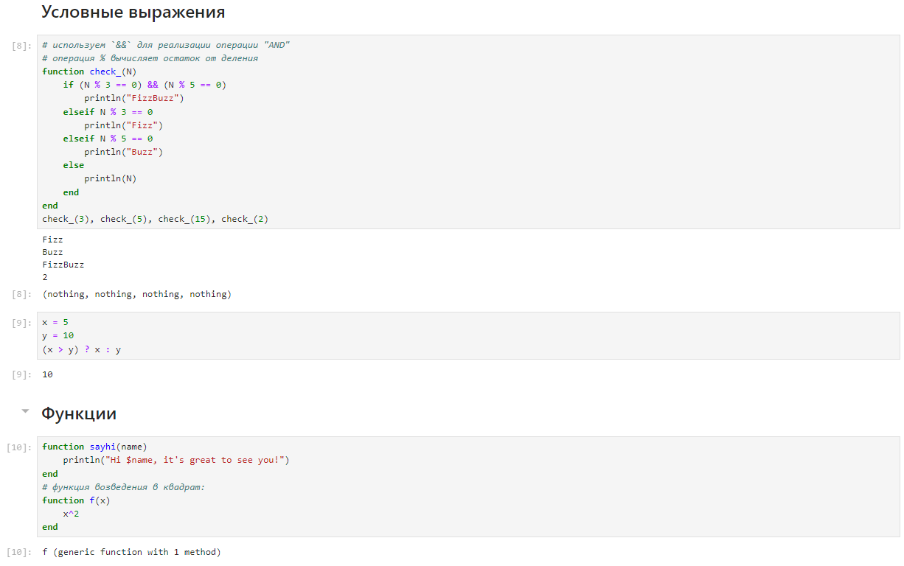

---
## Front matter
title: "Лабораторная работа №3"
subtitle: "Дисциплина: Компьютерный практикум по статистическому моделированию"
author: "Манаева Варвара Евгеньевна"

## Generic otions
lang: ru-RU
toc-title: "Содержание"

## Bibliography
bibliography: bib/cite.bib
csl: pandoc/csl/gost-r-7-0-5-2008-numeric.csl

## Pdf output format
toc: true # Table of contents
toc-depth: 2
lof: true # List of figures
lot: true # List of tables
fontsize: 12pt
linestretch: 1.5
papersize: a4
documentclass: scrreprt
## I18n polyglossia
polyglossia-lang:
  name: russian
  options:
	- spelling=modern
	- babelshorthands=true
polyglossia-otherlangs:
  name: english
## I18n babel
babel-lang: russian
babel-otherlangs: english
## Fonts
mainfont: PT Serif
romanfont: PT Serif
sansfont: PT Sans
monofont: PT Mono
mainfontoptions: Ligatures=TeX
romanfontoptions: Ligatures=TeX
sansfontoptions: Ligatures=TeX,Scale=MatchLowercase
monofontoptions: Scale=MatchLowercase,Scale=0.9
## Biblatex
biblatex: true
biblio-style: "gost-numeric"
biblatexoptions:
  - parentracker=true
  - backend=biber
  - hyperref=auto
  - language=auto
  - autolang=other*
  - citestyle=gost-numeric
## Pandoc-crossref LaTeX customization
figureTitle: "Рис."
tableTitle: "Таблица"
listingTitle: "Листинг"
lofTitle: "Список иллюстраций"
lotTitle: "Список таблиц"
lolTitle: "Листинги"
## Misc options
indent: true
header-includes:
  - \usepackage{indentfirst}
  - \usepackage{float} # keep figures where there are in the text
  - \floatplacement{figure}{H} # keep figures where there are in the text
---

# Техническое оснащение:

- Персональный компьютер с операционной системой Windows 10;
- Планшет для записи видеосопровождения и голосовых комментариев;
- Microsoft Teams, использующийся для записи скринкаста лабораторной работы;
- Приложение Pycharm для редактирования файлов формата *md*;
- *pandoc* для конвертации файлов отчётов и презентаций.

# Цели и задачи работы
## Цель

Освоить применение циклов функций и сторонних для Julia пакетов для решения задач линейной алгебры и работы с матрицами.

## Задачи [@lab:3]

1. Используя Jupyter Lab, повторите примеры из раздела 3.2.
2. Выполните задания для самостоятельной работы (раздел 3.4).

# Выполнение лабораторной работы

## Повторение примеров

1. Циклы `while` и `for` (@fig:101);
2. Условные выражения (@fig:102);
3. Функции (@fig:102, @fig:103, @fig:104, @fig:105);
4. Сторонние библиотеки (пакеты) в Julia (@fig:106).

{#fig:101 width=80%}

{#fig:102 width=80%}

{#fig:103 width=80%}

{#fig:104 width=80%}

{#fig:105 width=80%}

{#fig:106 width=80%}

## Самостоятельная работа [@julia:oficialdoc]

1. Используя циклы while и for (@fig:201_1, @fig:201_2):
- выведите на экран целые числа от 1 до 100 и напечатайте их квадраты;
- создайте словарь squares, который будет содержать целые числа в качестве ключей и квадраты в качестве их пар-значений;
- создайте массив squares_arr, содержащий квадраты всех чисел от 1 до 100.

{#fig:201_1 width=80%}

{#fig:201_2 width=80%}

2. Напишите условный оператор, который печатает число, если число чётное, и строку «нечётное», если число нечётное.
Перепишите код, используя тернарный оператор. (@fig:202)

{#fig:202 width=80%}

3. Напишите функцию `add_one`, которая добавляет $1$ к своему входу. (@fig:203)

{#fig:203 width=80%}

4. Используйте `map()` или `broadcast()` для задания матрицы $A$, каждый элемент которой увеличивается на единицу по 
сравнению с предыдущим. (@fig:204)

{#fig:204 width=80%}

5. Задайте матрицу $A$ следующего вида (@fig:205):

$$
A = \begin{pmatrix}
1 & 1 & 3 \\
5 & 2 & 6 \\
-2 & -1 & -3
\end{pmatrix}
$$

- Найдите $A^3$
- Замените третий столбец матрицы $A$ на сумму 2-го и 3-го столбцов

{#fig:205 width=80%}

6. Создайте матрицу $B$ с элементами $B_{i1} = 10, B_{i2} = −10, B_{i3} = 10, \quad i = 1, 2, … , 15$.
Вычислите матрицу $C = B^T B$. (@fig:206)

{#fig:206 width=80%}

7. Создайте матрицу $Z$ размерности $6\times 6$, все элементы которой равны нулю, и матрицу $E$, все элементы которой равны $1$.
Используя цикл `while` или `for` и закономерности расположения элементов, создайте следующие матрицы размерности $6\times 6$ (@fig:207_1, @fig:207_2):

$$
Z_1 = \begin{pmatrix}
0 & 1 & 0 & 0 & 0 & 0 \\
1 & 0 & 1 & 0 & 0 & 0 \\
0 & 1 & 0 & 1 & 0 & 0 \\
0 & 0 & 1 & 0 & 1 & 0 \\
0 & 0 & 0 & 1 & 0 & 1 \\
0 & 0 & 0 & 0 & 1 & 0
\end{pmatrix}, \qquad
Z_2 = \begin{pmatrix}
1 & 0 & 1 & 0 & 0 & 0 \\
0 & 1 & 0 & 1 & 0 & 0 \\
1 & 0 & 1 & 0 & 1 & 0 \\
0 & 1 & 0 & 1 & 0 & 1 \\
0 & 0 & 1 & 0 & 1 & 0 \\
0 & 0 & 0 & 1 & 0 & 1
\end{pmatrix},
$$

$$
Z_3 = \begin{pmatrix}
0 & 0 & 0 & 1 & 0 & 1 \\
0 & 0 & 1 & 0 & 1 & 0 \\
0 & 1 & 0 & 1 & 0 & 1 \\
1 & 0 & 1 & 0 & 1 & 0 \\
0 & 1 & 0 & 1 & 0 & 0 \\
1 & 0 & 1 & 0 & 0 & 0
\end{pmatrix}, \qquad
Z_4 = \begin{pmatrix}
1 & 0 & 1 & 0 & 1 & 0 \\
0 & 1 & 0 & 1 & 0 & 1 \\
1 & 0 & 1 & 0 & 1 & 0 \\
0 & 1 & 0 & 1 & 0 & 1 \\
1 & 0 & 1 & 0 & 1 & 0 \\
0 & 1 & 0 & 1 & 0 & 1
\end{pmatrix}.
$$

{#fig:207_1 width=80%}

{#fig:207_2 width=80%}

8. В языке R есть функция outer(). Фактически, это матричное умножение с возможностью изменить применяемую операцию (например, заменить произведение на
сложение или возведение в степень).
- Напишите свою функцию, аналогичную функции outer() языка R. Функция должна иметь следующий интерфейс: `outer(x,y,operation)`.
Таким образом, функция вида `outer(A,B,*)` должна быть эквивалентна произведению матриц $A$ и $B$ размерностями $L\times M$ и
$M\times N$ соответственно, где элементы результирующей матрицы $C$ имеют вид $C_{ij} = \sum_{k=1}^{M} A_{ik}B_{kj}$ (или в тензорном
виде $C_i^j = \sum_{k=1}^{M} A^i_kB^k_j$)
- Используя написанную вами функцию `outer()`, создайте матрицы следующей структуры:

$$
A_1 = \begin{pmatrix}
0 & 1 & 2 & 3 & 4 \\
1 & 2 & 3 & 4 & 5 \\
2 & 3 & 4 & 5 & 6 \\
3 & 4 & 5 & 6 & 7 \\
4 & 5 & 6 & 7 & 8
\end{pmatrix}, \quad
A_2 = \begin{pmatrix}
0 & 0 & 0 & 0 & 0 \\
1 & 1 & 1 & 1 & 1 \\
2 & 4 & 8 & 16 & 32 \\
3 & 9 & 27 & 81 & 243 \\
4 & 16 & 64 & 256 & 1024
\end{pmatrix},
$$

$$
A_3 = \begin{pmatrix}
0 & 1 & 2 & 3 & 4 \\
1 & 2 & 3 & 4 & 0 \\
2 & 3 & 4 & 0 & 1 \\
3 & 4 & 0 & 1 & 2 \\
4 & 0 & 1 & 2 & 3
\end{pmatrix}, \quad
A_4 = \begin{pmatrix}
0 & 1 & 2 & 3 & 4 & 5 & 6 & 7 & 8 & 9 \\
1 & 2 & 3 & 4 & 5 & 6 & 7 & 8 & 9 & 0 \\
\vdots & \vdots & \vdots & \vdots & \vdots & \vdots & \vdots & \vdots & \vdots & \vdots \\
8 & 9 & 0 & 1 & 2 & 3 & 4 & 5 & 6 & 7 \\
9 & 0 & 1 & 2 & 3 & 4 & 5 & 6 & 7 & 8
\end{pmatrix},
$$

$$
A_5 = \begin{pmatrix}
0 & 8 & 7 & 6 & 5 & 4 & 3 & 2 & 1 \\
1 & 0 & 8 & 7 & 6 & 5 & 4 & 3 & 2 \\
2 & 1 & 0 & 8 & 7 & 6 & 5 & 4 & 3 \\
3 & 2 & 1 & 0 & 8 & 7 & 6 & 5 & 4 \\
4 & 3 & 2 & 1 & 0 & 8 & 7 & 6 & 5 \\
5 & 4 & 3 & 2 & 1 & 0 & 8 & 7 & 6 \\
6 & 5 & 4 & 3 & 2 & 1 & 0 & 8 & 7 \\
7 & 6 & 5 & 4 & 3 & 2 & 1 & 0 & 8 \\
8 & 7 & 6 & 5 & 4 & 3 & 2 & 1 & 0
\end{pmatrix}.
$$

В каждом случае ваше решение должно быть легко обобщаемым на случай создания матриц большей размерности, но той же структуры. (@fig:208_1, @fig:208_2, @fig:208_3)

{#fig:208_1 width=80%}

{#fig:208_2 width=80%}

{#fig:208_3 width=80%}

9. Решите следующую систему линейных уравнений с 5 неизвестными

$$
\begin{cases}
x_1 + 2x_2 + 3x_3 + 4x_4 + 5x_5 = 7, \\
2x_1 + x_2 + 2x_3 + 3x_4 + 4x_5 = −1, \\
3x_1 + 2x_2 + x_3 + 2x_4 + 3x_5 = −3, \\
4x_1 + 3x_2 + 2x_3 + x_4 + 2x_5 = 5, \\
5x_1 + 4x_2 + 3x_3 + 2x_4 + x_5 = 17,
\end{cases}
$$

рассмотрев соответствующее матричное уравнение $Ax = y$. Обратите внимание на особый вид матрицы $A$.
Метод, используемый для решения данной системы уравнений, должен быть легко обобщаем на случай большего числа уравнений,
где матрица $A$ будет иметь такую же структуру (@fig:209_1, @fig:209_2).

{#fig:209_1 width=80%}

{#fig:209_2 width=80%}

10. Создайте матрицу $M$ размерности $6 \times 10$, элементами которой являются целые числа,
выбранные случайным образом с повторениями из совокупности $1, 2,\dots, 10$.
- Найдите число элементов в каждой строке матрицы $M$, которые больше числа $N$
(например, $N$ = 4).
- Определите, в каких строках матрицы $M$ число $M$(например, $M$ = 7) встречается ровно 2 раза?
- Определите все пары столбцов матрицы $M$, сумма элементов которых больше $K$
(например, $K$ = 75). (@fig:2010)

{#fig:2010 width=80%}

11. Вычислите (@fig:2011):

- $\sum_{i=1}^{20} \sum_{j=1}^{5} \frac{i^4}{(3+j)}$
- $\sum_{i=1}^{20} \sum_{j=1}^{5} \frac{i^4}{(3+ij)}$

{#fig:2011 width=80%}

# Выводы по проделанной работе

## Вывод

В результате выполнения работы мы освоили применение циклов функций и сторонних для Julia пакетов для решения задач линейной
алгебры и работы с матрицами.

Были записаны скринкасты выполнения и защиты лабораторной работы.

Ссылки на скринкасты:

- [Выполнение, Youtube](https://youtu.be/wNGiWOhal0w)
- [Выполнение, Rutube](https://rutube.ru/video/6c8fd5c68c6d6c0634cd37062703fdb5)
- [Защита презентации, Youtube](https://youtu.be/XXmS3Rd8fiw)
- [Защита презентации, Rutube](https://rutube.ru/video/c5ccb070730656894fd5a1cf6eb89df0)

# Список литературы

