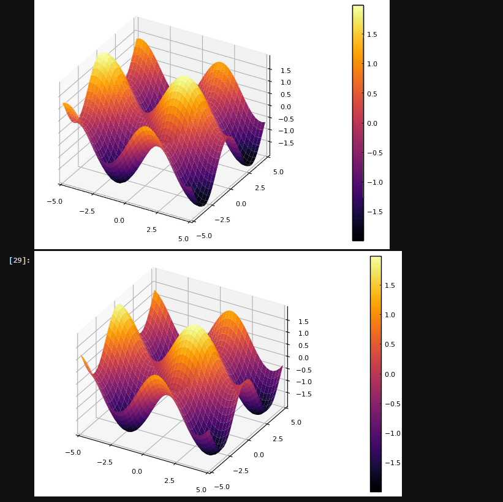

---
## Front matter
lang: ru-RU
title: "Лабораторная работа №8. Элементы криптографии. Шифрование (кодирование) различных исходных текстов одним ключом"
subtitle: "Дисциплина: Информационная безопасность"
author:
  - Манаева Варвара Евгеньевна.
institute:
  - Российский университет дружбы народов, Москва, Россия
date: 21 октября 2023

## i18n babel
babel-lang: russian
babel-otherlangs: english

## Formatting pdf
toc: false
toc-title: Содержание
slide_level: 2
aspectratio: 169
section-titles: true
theme: metropolis
header-includes:
 - \metroset{progressbar=frametitle,sectionpage=progressbar,numbering=fraction}
 - '\makeatletter'
 - '\beamer@ignorenonframefalse'
 - '\makeatother'
---

# Цели и задачи работы

## Цель лабораторной работы

Изучение механизма шифрования гаммирование как простейшего варианта системы шифрования с закрытым ключом.

## Задачи

1. Рассмотреть особенности и особенности кодирование однократного гаммирования с использованием одного ключа.
2. Создать код, который будет показывать принцип работы нескольких шифротекстов с одним ключом и его взлом.
3. изучить способы взлома и декодирование шифротекста без ключа.

# Код

## Создание ключа

```python
def key_create(s, alf):
    k = ''.join(random.choice(alf) for i in range(s))
    return k
```

## Шестнадцатиричная кодировка символов

```python
def hex_coder(cod):
    return ' '.join(hex(ord(i))[2:] for i in cod
```

## Шифрование/дешифрование при помощи ключа

```python
def string_coder(text, k, i_num):
    if i_num == 1:
        return ''.join(chr(ord(c) ^ ord(k)) for c, k in zip(text, k))
    else:
        return [''.join(chr(ord(c) ^ ord(k)) for c, k in zip(t, k)) for t in text]
```

## Поиск ключа по тексту

```python
def find_key(cypher, texts, s):
    possible_keys = []
    for f in range(len(texts)):
        for i in range(len(cypher[f]) - s + 1):
            key = [chr(ord(c) ^ ord(k)) for c, k in zip(cypher[f][i:i + s], texts[f])]
            intact_plaintext = string_coder(cypher[f], key, 1)
            if texts[f] in intact_plaintext:
                possible_keys.append(''.join(key))
    return possible_keys
```

## Результат

{#fig:001 width=80%}

# Контрольные вопросы

## Как, зная один из текстов (P1 или P2), определить другой, не зная при этом ключа?

Ответ: Это возможно сделать только в том случае если текст P1 и P2 одной длины и имеют общий ключ.

## Что будет при повторном использовании ключа при шифровании текста?

Ответ: Из-за одинаковости способа кодирование и декодирование после повторного использование слова и ключа даст нам шифротекст.

## Как реализуется режим шифрования однократного гаммирования одним ключом двух открытых текстов?

Ответ: Фактически, следуя схеме 8.1 и принципу "шифра XOR", мы просто имеем два параллельных кодирования и декодирования
с использованием одного ключа.

## Перечислите недостатки шифрования одним ключом двух открытых текстов.

Ответ: Если вспомнить требования для абсолютной стойкости шифра, рассмотренных в предыдущей лабораторной, 
можно сразу понять по первому же пункту, что если ключ не будет случайным и каждый раз новым для каждой строки,
то, найдя пересечения или аналоги в шифротекстах, можно определить одинаковые символы, что может пошатнуть защиту
текста даже если у вас нет ни одного исходного кода. При этом получается, что если есть исходный текст (хотя бы один 
образец), определить другие слова становится легко.

## Перечислите преимущества шифрования одним ключом двух открытых текстов.

Ответ:

- требуется передать один ключ, что сделать проще и быстрее
- при передаче большого количества шифротекста нет шанса запутаться в их порядке сочетания с ключами.

# Выводы по проделанной работе

## Вывод

В результате выполнения работы мы освоили на практике применение режима однократного гаммирования и возможных способах взлома при отсутствии ключа и наличие исходных текстов и шифротекстов.

Были записаны скринкасты выполнения и защиты лабораторной работы.
