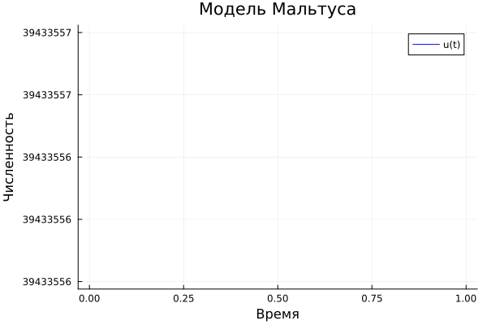
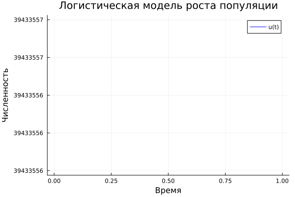
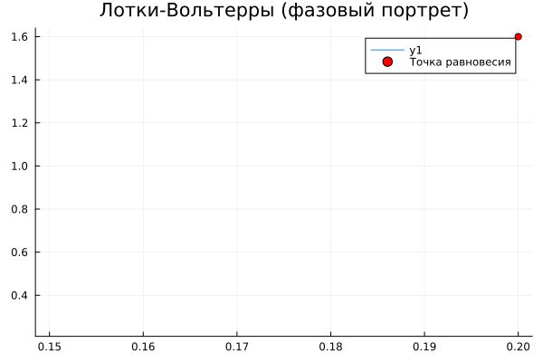
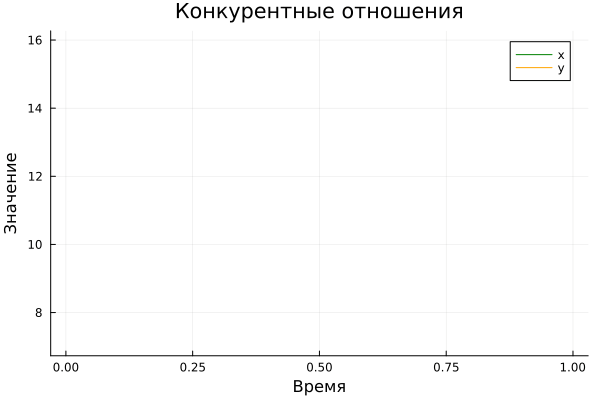
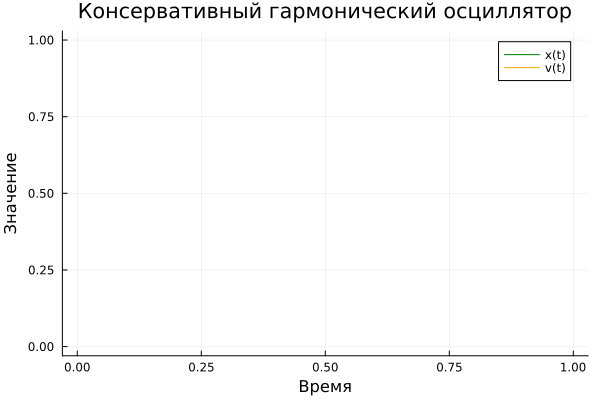

---
## Front matter
lang: ru-RU
title: "Лабораторная работа №6"
subtitle: "Дисциплина: Компьютерный практикум по статистическому анализу данных"
author:
  - Манаева Варвара Евгеньевна.
institute:
  - Российский университет дружбы народов, Москва, Россия
date: 12 декабря 2023

## i18n babel
babel-lang: russian
babel-otherlangs: english

## Formatting pdf
toc: false
toc-title: Содержание
slide_level: 2
aspectratio: 169
section-titles: true
theme: metropolis
header-includes:
 - \metroset{progressbar=frametitle,sectionpage=progressbar,numbering=fraction}
 - '\makeatletter'
 - '\beamer@ignorenonframefalse'
 - '\makeatother'
---

# Цели и задачи работы

## Цель лабораторной работы

Освоение специализированных пакетов для решения задач в непрерывном и дискретном времени.

## Задачи

1. Повторить примеры из раздела 6.2
2. Выполнить задания для самостоятельной работы из раздела 6.4

# Выполнение лабораторной работы
##

{width=80%}

##

{width=80%}
##

{width=80%}

##

{width=80%}

##

{width=80%}

##

{width=80%}

##

{width=80%}

##

{width=80%}

# Выводы по проделанной работе

## Вывод

