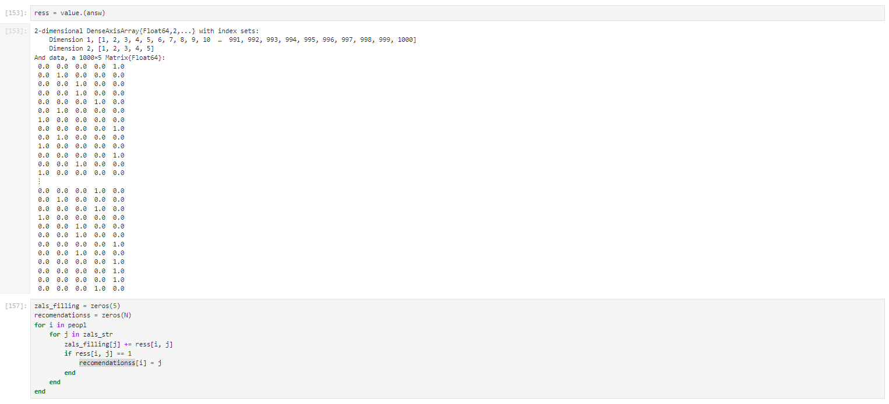

---
## Front matter
title: "Лабораторная работа №8"
subtitle: "Дисциплина: Компьютерный практикум по статистическому моделированию"
author: "Манаева Варвара Евгеньевна"

## Generic otions
lang: ru-RU
toc-title: "Содержание"

## Bibliography
bibliography: bib/cite.bib
csl: pandoc/csl/gost-r-7-0-5-2008-numeric.csl

## Pdf output format
toc: true # Table of contents
toc-depth: 2
lof: true # List of figures
lot: true # List of tables
fontsize: 12pt
linestretch: 1.5
papersize: a4
documentclass: scrreprt
## I18n polyglossia
polyglossia-lang:
  name: russian
  options:
	- spelling=modern
	- babelshorthands=true
polyglossia-otherlangs:
  name: english
## I18n babel
babel-lang: russian
babel-otherlangs: english
## Fonts
mainfont: PT Serif
romanfont: PT Serif
sansfont: PT Sans
monofont: PT Mono
mainfontoptions: Ligatures=TeX
romanfontoptions: Ligatures=TeX
sansfontoptions: Ligatures=TeX,Scale=MatchLowercase
monofontoptions: Scale=MatchLowercase,Scale=0.9
## Biblatex
biblatex: true
biblio-style: "gost-numeric"
biblatexoptions:
  - parentracker=true
  - backend=biber
  - hyperref=auto
  - language=auto
  - autolang=other*
  - citestyle=gost-numeric
## Pandoc-crossref LaTeX customization
figureTitle: "Рис."
tableTitle: "Таблица"
listingTitle: "Листинг"
lofTitle: "Список иллюстраций"
lotTitle: "Список таблиц"
lolTitle: "Листинги"
## Misc options
indent: true
header-includes:
  - \usepackage{indentfirst}
  - \usepackage{float} # keep figures where there are in the text
  - \floatplacement{figure}{H} # keep figures where there are in the text
---

# Техническое оснащение:

- Персональный компьютер с операционной системой Windows 10;
- Планшет для записи видеосопровождения и голосовых комментариев;
- Microsoft Teams, использующийся для записи скринкаста лабораторной работы;
- Приложение Pycharm для редактирования файлов формата *md*;
- *pandoc* для конвертации файлов отчётов и презентаций.

# Цели и задачи работы
## Цель

Освоить пакеты Julia для решения задач оптимизации.

## Задачи [@lab:8]

1. Повторить примеры из раздела 8.2
2. Выполнить задания для самостоятельной работы из раздела 8.4

# Выполнение лабораторной работы

## Повторение примеров

Повторение примеров (@fig:001, @fig:002, @fig:003, @fig:004, @fig:005, @fig:006, @fig:007, @fig:008, @fig:009, @fig:0010
, @fig:0011, @fig:0012, @fig:0013)

{#fig:001 width=80%}

{#fig:002 width=80%}

{#fig:003 width=80%}

{#fig:004 width=80%}

{#fig:005 width=80%}

{#fig:006 width=80%}

{#fig:007 width=80%}

{#fig:008 width=80%}

{#fig:009 width=80%}

{#fig:0010 width=80%}

{#fig:0011 width=80%}

{#fig:0012 width=80%}

{#fig:0013 width=80%}

## Самостоятельная работа [@julia:oficialdoc]

Самостоятельная работа (@fig:0014, @fig:0015, @fig:0016, @fig:0017, @fig:0018, @fig:0019, @fig:0020, @fig:0021, @fig:0022)

{#fig:0014 width=80%}

{#fig:0015 width=80%}

{#fig:0016 width=80%}

{#fig:0017 width=80%}

{#fig:0018 width=80%}

{#fig:0019 width=80%}

{#fig:0020 width=80%}

{#fig:0021 width=80%}

{#fig:0022 width=80%}

# Выводы по проделанной работе

## Вывод

В результате выполнения работы мы освоили пакеты Julia для решения задач оптимизации.

Были записаны скринкасты выполнения и защиты лабораторной работы.

Ссылки на скринкасты:

- [Выполнение, Youtube](https://youtu.be/kTs5GB3mHOc)
- [Выполнение, Rutube](https://rutube.ru/video/265563ad8c9231b3810d35552e8b357c)
- [Защита презентации, Youtube](https://youtu.be/SvYTTRwtF1A)
- [Защита презентации, Rutube](https://rutube.ru/video/0d1c8ed1b1e92bb1f11c17644a61fa8b)

# Список литературы

